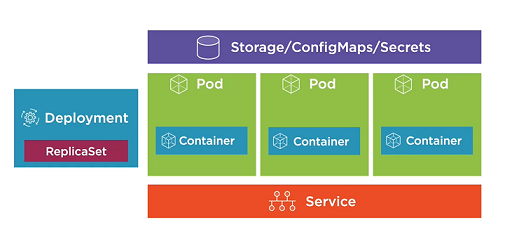

# Kubernetes
Kubernetes is an open-source container-orchestration system for automating computer application deployment, scaling, and management. 
It was originally designed by Google and is now maintained by the Cloud Native Computing Foundation.

There are several ways to get running kubernetes. 
One of the easy way to get Kubernetes get running is using Docker Desktop.

**Kubernetes basic commands:** <br />
```shell script
kubectl version                                       # Check Kubernetes version
kubectl cluster-info                                  # View cluster information
kubectl get all                                       # Retrieve information about kubernetes Pods, Deployments, services, and more
kubectl run [container-name] --image=[image-name]     # Simple way to create a Deployment for a pod
kubectl port-forward [pod] [ports]                    # Formward a port to allow external access
kubectl expose ...                                    # Expose a port for a Deployment/Pod
kubectl create [resources]                            # Create a resource
Kubectl apply [resources]                             # create or apply
```

#### Kubernetes Web UI Dashboard
Enabling the Web UI
- kubectl apply -f https://raw.githubusercontent.com/kubernetes/dashboard/v2.0.0/aio/deploy/recommended.yaml
- kubectl describe secret -n kube-system   
Copy the first token (Type:  kubernetes.io/service-account-token)
- Kubectl proxy
visit the link and login to the web UI by pasting the token.

## Basic Components of the Kubernetes Stack
1. Pods
2. Deployments
3. Services
4. Storage
5. ConfigMaps and Secrets



## 1. Pods
Act as Host for our container.
A Pod is the basic execution unit of the Kubernetes application-the smallest and simplest unit in the kubernetes object model that you create or deploy.
Pod runs containers
- Pods are the Environment for containers 
- Organize application "parts" into Pods (server, caching, APIs, database etc)
- Pod IP, memory, volumes etc shared across containers
- Scale horizontally by adding Pod replicas
- Pods live and die but never come back to life (remove and replace)

Master Node -->  Node (or Worker node) --> Pod --> Containers
- All Pods in a node will have unique IP address
- All containers in a Pod will have their unique Ports
Note:
- Pod Containers share the same Network namespace (share IP/port)
- Pod containers have the same loopback network interface (localhost)
- Container processes nedd to bind to different ports within a pod


#### Creating a Pod (several ways)
```shell script
kubectl run [podname] --image=nginx:alpine
```
OR
```shell script
kubectl create/apply command with a yaml file
kubectl get pods
```
#### Expose a Pod Port:
Pods and container are only accessible within the Kubernetes cluster by default.
One way to expose a container port externally: `kubectl port-forward`
```shell script
kubectl port-forward [name-of-pod] 8080:80            # first port(8080) is External port and second port(80) is internal port.
```

#### Deleting a Pod:
```shell script
- kubectl delete pod [name-of-pod]                    # Will cause pod to be recreated
- kubectl delete deployment [name-of-deployment]      # Delete Deployment that manages the Pod

```
Now Declarative way (Using YAML)

#### YAML:
- YAML file are composed of maps and lists
- Indentation matters (be consistent)
- Always use spaces
- Maps:
  - Name: value pairs
  - Maps can contain other maps for more complex data structure
- Lists:
  - Sequence of items
  - Multiple maps can be defined in a list

#### Defining a Pod with YAML (File --> nginx.pod.yml)
```yaml
apiVersion: v1                # Kubernetes API version
kind: Pod                     # Type of Kubernetes resources
metadata:                     # Metadata about the Pod
   name: my-nginx
spec:                         # The spec/blueprint for the Pod
   containers:                # Information about the containers that will run in the Pod
   - name: my-nginx
     image: nginx:alpine
```
#### Create a Pod using YAML File
- To create a pod using YAML, use the `kubectl create` command along with the `--filename` or `-f` switch
- Perform a "trial" create and also validate the YAML
```shell script
kubectl create -f file.pod.yml --dry-run --validate=true
```
- Create a Pod from YAML, Will error if Pod already exists
```shell script
kubectl create -f file.pod.yml
```
#### Creating or Applying Changes to a Pod
- To create or apply changes to a pod using YAML, use the `kubectl apply` command along with the `--filename` or `-f` switch
```shell script
kubectl apply -f file.pod.yml
```
- Use `--save-config` when you want to use `kubectl apply` in the future
```shell script
kubectl create -f file.pod.yml --save-config
```
NOTE: In-place/non-disruptive chnages can also be made to a Pod using kubectl edit or kubectl patch.

#### Pod Health
- Kubernetes relies on Probes to determine the health of a Pod container.
- A prode is a diagnostic perfromed periodically by  the kubelet on a container.

**Types of Probes:**
1. Liveness probes can be used to determine if a Pod is healthy and running as expected
2. Readiness probes can be used to determine if a Pod should receive requests
##### Defining an HTTP Liveness Probe
```yaml
apiVersion: v1
kind: Pod
....
spec:
   containers:
   - name: my-nginx
   image: nginx:alpine
   livenessProbe:                    --> Define liveness probe
      httpGet:
        path: /index.html            --> Check Get /index.html on port 80
        port: 80
      initialDelaySeconds: 15        --> Wait 15 seconds
      timeoutSeconds: 2              --> Timeout after 2 seconds
      periodSeconds: 5               --> Check every 5 seconds
      failureThreshold: 1            --> Allow 1 failure before failing Pod
```
**Another Example**
##### Defining an ExecAction Liveness Probe
```yaml
apiVersion: v1
kind: Pod
...
spec:
   containers:
   - name: liveness
     image: k8s.gcr.io/busybox
     args:
     - /bin/sh
     - -c
     - touch /tmp/healthy; sleep 30;
       rm -rf /tmp/healthy; sleep 600
     
     livenessProbe:
        exec:
           command:
           - cat
           - /tmp/healthy
        initialDelaySeconds: 5
        periodSeconds:5
```
### Summary:
- Pods are the smallest unit of Kubernetes
- Containers run within Pods and share a Pod's memory, IP, Volumes and more
- Pods can be started using different kubectl commands
- YAMLcan be used to create a Pod
- Health checks provide a way to notify Kubernetes when a Pod has a problem.


## 2. Deployments
#### Deployments Core Concepts
- ReplicaSet is a declarative way to manage Pods
- A deployment is a declarative way to manage Pods using a ReplicaSet.
- Deployments and ReplicaSets ensure Pods stay running and can be used to scale Pods.
#### The role of ReplicaSets
- ReplicaSets act as a Pod controller
  - Self-Healing mechanism
  - Ensure the requested number of Pods
  - provide fault-tolerance
  - can be used to scale Pods
  - Relies on aPod template
  - No need to create  Pods directly
  - Used by deployments.
- A deployment manages Pods:
  - Pods are managed using ReplicaSets
  - Scales ReplicaSets, which scale Pods
  - Support sero-downtime updates by creating and destroying ReplicaS3ets
  - Provides rollback functionality
  - Creates a unique label that is assigned to the ReplicaSet and Generated Pods
  - YAML is very similar to a ReplicaSet
#### Creating a Deployment
(High-Level)
```yaml
apiVersion: apps/v1
kind: deployment
metadata: 
sepc:
   selector:                     # Select Pod Template label(s)
   template:
     spec:                       # Templates used to create the Pods
        containers:
        - name: my-nginx         # Containers that will run in the Pod
          image: nginx:alpine
```
#### Creating or Applying Changes
```shell script
- Kubectl apply -f file.deployment.yml
- kubectl create -f file.deployment.yml --save-config
- kubectl get deployments
- kubectl get deployment --show-labels
```

#### Deleting deployment
- kubectl delete deployment [deployment-name]
#### Scale the Deployment Pods to 5
Scaling Pods Horizontally: Update the YAML file or the kubectl scale command
- kubectl scale deployment [deployment-name] --replicas=5
Scale by referencing the YAML file
- kubectl scale -f file.deployment.yml --replicas=5


#### Deployment In action:
```yaml
apiVersion: apps/v1
kind: Deployment
metadata: 
   name: my-nginx
   labels:
      app: my-nginx
spec:
   selector: 
      matchLabels:
          app: my-nginx
   template: 
      metadata:
          labels:
             app: my-nginx
      spec:
          containers:
          - name: my-nginx
            image: nginx:alpine
            ports:
            - containerPort: 80
            resources:
                limits:
                   memory: "128Mi"               --> 128 MB
                   cpu: "200m"                   --> 200 Millicpu (.2 cpu or 20% of the CPU)
```
#### Deployment Options:
- One of the strengths of kubernetes is zero downtime deployments
- Update an application's Pods without impacting end users
- Several options are available:
    - Rolling updates
    - Blue-green deployments
    - Canary deployments
    - Rollbacks
- Rolling Deployment for newer version of nginx
    - Update a deployment by changing the YAML and applying changes to the cluster with `kubectl apply`
    ```shell script
    kubectl apply -f file.deployment.yml
    ```
    
### Summary:
- Pods are deployed, managed and scaled using deployment and ReplicaSets
- Deployment are a higher-level resource that define one or more Pod template
- the kubectl create or apply commands can be used to run a deployment
- Kubernetes support zero downtime deployments

## 3. Services:
#### Services Core Concept
A service provides a single point of entry for accessing one or more Pods
Question: Since Pods live and die, can you rely on their IP?
Answer: No! Thats's why we need services - IPs change a lot!

- Pods are "mortal" and may only live a short time.
- You can't rely on a Pod IP address staying the same
- Pods can be horizontally scaled so each Pod gets its own IP address
- A Pod gets an IP address after it has been scheduled (no way for clients to know IP ahead of time)
#### The role of the Services
- Services abstract Pod IP addresses from consumers
- Load balances between Pods
- Relies on labels to associate a Service with a Pod
- Node's kube-proxy creates a virtual IP for Services
- Layer 4 (TCP/UDP over IP) - 
- Services are not ephemeral (are not short lived)
- Creates endpoints which sit between a Service and Pod
#### Service Types
Services can be defined in different ways:
- ClusterIP - Expose the service on a cluster-internal IP (Default)
- NodePort - Expose the service on each Node's IP at a static port.
- LoadBalancer - Provision an external IP to act as a load balancer for the service
- ExternalName - Maps a service to a DNS name

1. ClusterIP Service
- Service IP is expose internally within the cluster
- Only Pods within the cluster can talk to the service
- Allows Pods to talk to other Pods

2. NodePort Service
- External caller calls node IP address and the Service is pointed using the port.
- Exposes the service on each Node's IP at a static port
- Allocate a port from a range (default is 30000-32767)
- Each Node proxies the allocated port

3. LoadBalancer service
- External caller calls the LoadBalancer IP, then request goes to specific Node based on the port.
- Exposes a service externally 
- Usefull when conbined with a cloud provider's load balancer
- NodePort and clusterIP services are created after the loadbalancer. Load balancer points to the Nodes.
- Each node proxies the allocated port.

4. ExternalName Service
- service that acts as an alias for an external service
- allows a service to act as the proxy for an external service
- External service details are hidden form cluster (easier to change)


#### Creating a Service
Q. How can you access a Pod from outside of Kubernetes?
A. Port forwarding

Use the kubectl port-forward to forward a local port to a Pod port

- Listen on port 8080 locally and forward to port 80 in Pod
```shell script
kubectl port-forward pod/[pod-name] 8080:80
```
- Listen on port 8080 locally and forward to Deployment's Pod
```shell script
kubectl port-forward deployment/[deployment-name] 8080
```
- Listen on port 8080 locally and forward to Service's Pod
```shell script
kubectl port-forward service/[service-name] 8080
```
#### Creating a Service with YAML
```yaml
apiVersion: v1
kind: Service
metadata:
spec:
   type:              --> Type of service (ClusterIP, NodePort, LoadBalancer) - defaults to ClusterIP

   selector:          --> Select Pod template label(s) that service will apply to 

   ports:             --> Define container target port and the port for the service
```


**Example:**
```yaml
apiVersion: v1
kind Service
metadata:
   name: frontend     --> Name of Service (each Service gets a DNS etry)
   ....
apiVersion: v1
kind: Service
metadata:
   name: backend      --> A frontend Pod can access a backend Pod using (backend:port)
   ....
```
(Note above, we dont have to worry about the IP address)

**Example: NodePort**
```yaml
apiVersion: v1
kind: Service
metadat:
...
spec:
   type: NodePort                --> Set Service type to NodePort
   selector: 
      app: nginx
   ports: 
   - port: 80
   targetPort: 80
   nodePOrt: 31000               --> Optionally set NodePort value (Defaults Between 30000-32767)
```
### Summary
- Pods live and die so their IP address can change
- Services abstract Pod IP addresses from consumers
- Labels associate a Service with a Pod
- Service types
   - ClusterIP (default)
   - NodePort
   - LoadBalancer
   - ExternalName (proxies to an external service)


## 4. Storage (Volumes)
Q. How do you store application state/data and exchange it between Pods with Kubernetes?
A. Volumes (although other data storage options exist)

- A volume can be used to hold data and state for Pods and containers.
- Pods live and die so their file system is short lived (ephemeral)
- volumes can be used to store state/data and use it in a pod
- A Pod can have multiple Volumes attached to it
- Containers rely on a mountPath to access a Volume
- Kubernetes supports:
   - Volumes
   - PersistentVolumes
   - PersitentVolumeClaims
   - StorageClasses
#### Volumes and Volume Mounts
- A volume references a storage location
- Must have a unique name
- Attached to a Pod and may or may not be tied to the Pod's lifetime (depending on the Volume type)
- A volume Mount references a Volume by name and defines a mountPath
#### Types:
- emptyDir - Empty directory for storing "transient" data (shares a Pod's lifetime) useful fro sharing files between containers running in a Pod.
- hostPath - Pod mounts into the node's filesystem
- nfs - An NFS (Network File System) share mounted into the Pod
- configMap/secret - Special types of volumes that provide a Pod with access to kubernetes resources
- persistentVolumeClaim - Provides Pods with a more persistent storage option that is abstracted from the details
- Cloud - Cluster-wide storage

**Example**
```yaml
apiVersion: v1
kind: Pod
spec:
   volumes:
   - name: html                                     --> Defined initial Vaolume named "Html" tjat is an empty directory (lifetime of the pod)
     emptyDir: {}
   containers:
   - name: nginx
     image: nginx:alpine
     volumeMounts:                                  --> Reference "html" Volume and define a mountPath
     - name: html
       mountPath: /usr/share/nginx/html
       readOnly: true
   - name: html-updater
     image: alpine
     command: ["/bin/sh", "-c"]
     args:
       - while true; do date >> /html/index.html;   --> Update file in Volume mount /html path with latest date every 10 seconds
           sleep 10; done
     volumeMounts:
       - name: html                                 --> Reference "html" Volume (defined above) and define a mountPath
         mountPath: /html
```
#### More robust cloud volumes
- Cloud providers (Azure, AWS, GCP, etc.) support different types of Volumes:
   - Azure - Azure Disk and Azure File
   - AWS - Elastic Block Store
   - GCP - GCE Persistent Disk

**Example - Azure**
```yaml
apiVersion: v1
kind: Pod
metadata: 
   name: my-pod
spec: 
   volumes:                            --> Define initial Volume named "data" that is Azure File storage
   - name: data
     azureFile:
        secretName: <azure-secret>
        shareName: <share-name>
        readOnly: false
   containers:
   - image: someimage
     name: my-app
     volumeMounts:                     --> Reference "data" Volume and define a mountPath 
     - name: data
       mountPath: /data/storage
```
### PersistentVolume (PV)
- PV is a cluster-wide storage unit provisioned by an administrator with a lifecycle independent from a Pod.
- A PersistentVolumeClaim (PVC) is a request for a storage unit (PV)
#### Details
- A PersistentVolume is  a cluster-wide storage resource that relies on the network-attached storage (NAS)
- Normally provisioned by a cluster administrator
- Available to a Pod even if it gets rescheduled to a different Node
- Rely on a storage provider such as NFS, cloud storage, or other options
- Associated with a Pod by using a PersistentVolumeClaim (PVC)

#### PersistentVolume Workflow (How it works)
1. Create Network storage resource (NFS, cloud, etc.)
2. Define a Persistent Volume (PV) and send to the Kubernetes API
3. Create a PersistentVolumeClaim (PVC)
4. Kubernetes binds the PVC to the PV

Pod --> PVC --> PV --> Kubernetes 
                   --> Storage
(Completes the cycle)

**Example - PV**
```yaml
apiVersion: v1
kind: PersistentVolume                        --> Create PersistentVolume Kind
metadata: 
   name: my-pv
spec:
   capacity: 10 Gi                            --> Define storage capacity
   accessModes:
      - RedWriteOnce                          --> One client can mount for read/write
      - ReadOnlyMany                          --> Many clients can mount for reading
   persistentVolumeClaimPolicy: Retain        --> Retain even after claim is deleted (not erased/deleted)
   azureFile:                                 --> Reference storage to use (Specific to cloud provider, NFS setup, etc.)
      secetName: <azure-secret>
      shareName: <name_from_azure>
      readOnly: false
```

(Now lets look into PVC)
**Example - PVC**
```yaml
kind: PersistentVolumeClaim                  --> Define a PersistentVolumeClaim (PVC)
apiVersion: v1
metadata:
   name: pv-dd-account-hdd-5g 
   annotations:
      volume.beta.kubernetes.io/storage-class: accounthdd
spec:
   accessModes:                               --> Define access mode
   - ReadWriteOnce
   resources:
      requests:
         storage: 5Gi                         --> Request storage amount
```
(Now lets see the Pod) - either using deployment spec or Pod spec
**Example - Pod**
```yaml
apiVersion: v1
kind: Pod
metadata:
   name: pod-uses-account-hdd-5g
   labels:
      name: storage
spec:
   containers:
   - image: nginx
     name: az-c-01
     command:
     - /bin/sh
     - -c
     - while true; do echo $(date) >> 
	/mnt/blobdisk/outfile; sleep; done
     volumeMounts:                              --> Mount to volume
     - name: blobdisk01
       mountPath: /mnt/blobdisk
   volumes:
   - name: blobdisk01                           --> Create Volume that binds to PersistentVolumeClaim
     persistentVolumeClaim:
       clmName: pv-dd-account-hdd-5g

```
### StorageClasses
- A storageClass(SC) is a type of storage template that can be used to dynamically provision storage.
- It can be combined to the provisioner
- We don't have to create PV, PVC etc on our own
Details:
- Used to define different "classes" of storage
- Act as type of storage template
- Supports dynamic provisioning of PersistentVolumes
- Administrators don't have to create PN in advance
#### StorageClass Workflows (How it works)
1. Create Storage class (SC)
2. Create PVC that references SC
3. Kubernetes uses SC provisioner to provision a PV
4. Storage provisioned, PersistentVolume created and bound o PersistentVolumeClaim
5. Pod Volume references PersitentVolumeClaim
we create SC, PV references SC name under storageClassName.


## 5. ConfigMaps and Secrets:
### ConfigMaps
- ConfigMaps provide a way to store configuration information and provide it to containers
- Provides a way to inject configuration data into a container
- Can store entire files or provide key/value pairs:
   - Store in a File. Key is the filename, value is the file contents (can be JSON, XML, keys/values etc.)
   - Provide on the command-line
   - ConfigMap manifest
#### Accessing ConfigMap data in a Pod
- ConfigMaps can be accessed from a Pod using:
   - Environment variable (key/value)
   - ConfigMap volume (access as files)
#### Creating ConfigMap (Using YAML)
```yaml
apiVersion: v1
kind: ConfigMap                        --> A ConfigMap
metadata:
   name: app-settings                  --> Name of ConfigMap
   labels:  
      app: app-settings
data:
   enemies: aliens                     --> ConfigMap data
   lives: "3"
   enemies.cheat: "true"
   enemies.cheat.level:noGoodRotten
```
- Create from a ConfigMap manifest
```shell script
kubectlcreate -f file.configmap.yml
```

#### Defining Key/Value Pairs in file (Another way)
```shell script
enemies=aliens
lives="3"
enemies.cheat="true"
enemies.cheat.level=noGoodRotten
```
 (For this we need to run following command)
- Create a ConfigMap usng data from a file
```shell script
kubectl create configmap [cm-name] --from-file=[path-to-file]
```

#### Using a ConfigMap (how we use it)
kubectl get cm can be used to get ConfigMap and view its contents
- Get a ConfigMap
```shell script
kubectl get cm [cm-name] -o yaml
```


#### 1. Accessing a ConfigMap: Environment Vars
- Pods can access ConfigMap values through environment vars.
- ENEMIES enviroment variable created (value-aliens)
E.g.:
```yaml
apiVersion: v1
...
spec:
   template:
      ...
   spec:
      containers: ...
      env:
      - name ENEMIES                --> Env var name
        valueFrom:
           configMapKeyRef:
              name: app-settings    --> Referenced to the previously defined ConfigMap (Metadata name)
              key: enemies
```

#### load whole configs
```yaml
spec:
  containers: ...
     envFrom:
     - configMapRef:
       name: app-settings
```
(This will load all the values from the ConfigMap and creates ENV variables for those 4 config values)


#### 2. Accessing a ConfigMap: Volume
- ConfigMap values can be loaded through a Valume
- Each key is converted to a file - value is added into the file 
E.g:
```yaml
apiVersion: apps/v1
...
spec:
   template:
      ...
   spec:
      volumes:
         - name: app-config-vol
           configMap:
               name: app-settings
      containers:
         valueMounts:
            - name: app-config-vol
              mountPath: /etc/config
```
(Note each values in the config will become a separate file in the /etc/config directory)


### Secrets
A secret is an object that contains a small amount of sensitive data such as a password, a token or a key.
- Kubernetes can store sensitive information (passwords, keys, certificates, etc.)
- Avoids storing secrets in contaner images, in file, or in deployment manifests
- Mount secrets into pods as files or as envirnment variables
- Kubernetes only makes secrets available to Nodes that have a Pod requesting the secret
- Secrets are stored in tmpfs on a Node (not on disk)

#### Secrets Best Practices:
- Enable encryption at rest for cluster data
- Limit access to etcd (where Secrets are stored) to obly admin users
- Use SSL/TLS for etcd peer to peer communication
- Manifest (YAML/JSON) files only base64 econded the secret (hence not recommended)
- Pods can access Secrets so secure which sers can create Pods. Role-based access control (RBAC) can be used.

#### Creating Secrets:
- secrets can be created using kubectl create secret
- Create a secret and store securely in Kubernetes
```shell script
kubectl create secret generic my-secret --from-literal=pwd=my-password
```
- Create a secret from a file
```shell script
kubectl create secret generic my-secret
   --from-file=ssh-privatekey=~/.ssh/id_rsa
   --from-file=ssh-publickey=~/.ssh/id_rsa.pub
```
- Create a secret from a key pair
```shell script
kubectl create secret tls tls-secret --cert=path/to/tls.cert
   --key=path/to/tls.key
```

Q. can I declarative define secrets using YAML?
A. Yes - but any secret data is only base64 encoded in the manifest file!

#### Using a Secret (How to use)
- Get secrets
```shell script
kubectl get secrets
```
- Get YAML for specific secret
```shell script
kubectl get secrets db-password -o yaml   (Normally shuts this down by the admins because show you based64 encoded data)
```

#### 1. Accessing a Secret: Environment Vars
- Pods can access Secrets values through environment variables
- DATABASE_PASSWORD environment var created\
```yaml
apiVersion: apps/v1
...
spec:
   template:
      ...
   spec:
      containers: ...
      env:
      - name: DATABASE_PASSWORD
        valueFrom: 
           secretKeyRef:
              name: db-passwords
              key: db-password
```


## Troubleshootings:
- View the logs for a Pod's container
```shell script
kubectl logs [pod-name]
```
- View the logs for a specific container within a Pod
```shell script
kubectl logs [pod-name] -c [container-name]
```
- View the logs for a previously running Pod
```shell script
kubectl logs -p [pod-name]
```
- Stream a Pod's logs
```shell script
kubectl logs -f [pod-name]
```
- describe a pod
```shell script
kubectl describe pod [pod-name]
```
- Change a Pod's output format
```shell script
kubectl get pod [pod-name] -o yaml
```
- Chnage a Deployment's output format
```shell script
kubectl get deployment [deployment-name] -o yaml
```
- Shell into a Pod Container
```shell script
kubectl exec [pod-name] -it sh
```

